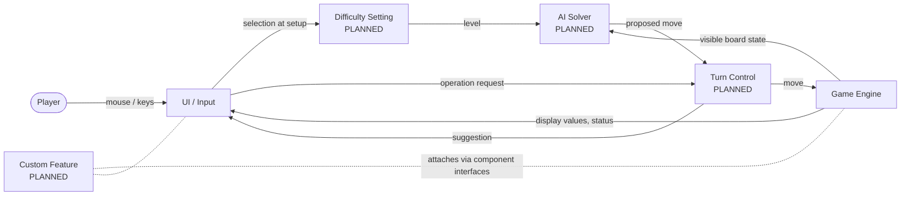

# System Architecture Overview (DRAFT)

Legend: **[EXISTING]** = inherited and described from the code. **[PLANNED]** = designed, not built; update after implementation.

## 1. Components

| Component | Responsibility | Status |
|-----------|----------------|--------|
| Game Engine | Owns board and game state; validates and applies moves; reports win/loss | [EXISTING] |
| UI / Input | Draws the board and status; converts mouse and keyboard input into engine operations; menus and end screen | [EXISTING] (extended by later work) |
| AI Solver | Reads board information and proposes a move at each difficulty level (Easy / Medium / Hard) | [PLANNED] |
| Difficulty Setting | A selectable difficulty level chosen during setup (before a game starts) and held as part of the game configuration; consumed by the components that vary with difficulty (at minimum the AI Solver) | [PLANNED] |
| Turn Control | Decides whether the next move comes from the player or the solver: interactive mode (solver suggests, player acts) and auto-solve mode (solver acts until the game ends) | [PLANNED] |
| Custom Feature | Placeholder until the team selects the feature | [PLANNED] |

## 2. Data Flow

**Current (existing):**
Player input → UI converts to a board position → Game Engine applies the operation → UI reads display values and redraws.

**With planned parts:**
0. Setup: the player selects a difficulty (and existing setup options); the choice is stored in the game configuration and read by the components that depend on it.
1. Turn Control selects the move source.
2. Player path: input → UI → Game Engine.
3. Solver path: Game Engine exposes visible board state → AI Solver (behaving per the current difficulty) returns a move → Turn Control passes it to the Game Engine (auto-solve) or to the UI as a suggestion (interactive).
4. Game Engine result → UI redraw and win/loss handling.

The solver sees only what a player sees (the visible-state view), never hidden mine positions.

## 3. System Diagram

If Turn Control is not built as a separate component, its role folds into the UI loop; the diagram then changes by removing that node and connecting UI ↔ AI Solver directly.

## 4. Key Data Structures

See `data_structures.md`. Summary: two parallel grids (hidden truth, player-visible state), a derived per-cell display code, and a small set of counters held in one engine instance.

## 5. Interfaces Between Components

- **UI → Engine:** dig, flag, chord by position.
- **Engine → UI:** per-cell display code, mine/flag counts, win status.
- **Engine → Solver:** visible-state view only.
- **Setup → Difficulty Setting:** one selected level per game.
- **Difficulty Setting → consumers:** read-only level value; consumers decide how it affects their behavior.
- **Solver → Turn Control:** one move (operation + position).
- Interfaces are the contract; internals of each component may change without invalidating this document.

## 6. Items to Update After Build

- [ ] Difficulty Setting: where it is stored, who reads it, what it changes
- [ ] AI Solver: actual difficulty behaviors and inputs/outputs
- [ ] Turn Control: final mechanism, or note that it merged into the UI
- [ ] Custom Feature: component entry, diagram node, data flow
- [ ] Diagram: replace placeholder nodes with final structure
