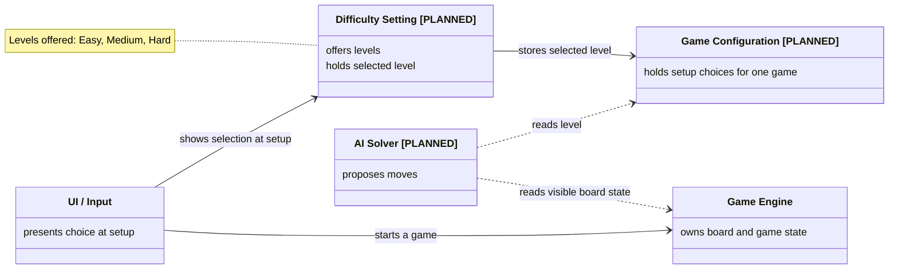

# Difficulty Selector: UML Class Diagram (DRAFT)

Abstract view. Shows roles and relationships only; update after the selector is built.

## Legend

- Solid arrow: the source uses or drives the target. Dotted arrow: the source only reads from the target.
- `[PLANNED]`: not built yet; update after implementation.
- Names match `architecture_overview.md`.
- Difficulty is shown only as a value that other components read; what it changes is not decided.
- If the selector becomes the custom feature, rename Difficulty Setting to Custom Feature in this diagram and in the architecture doc.
